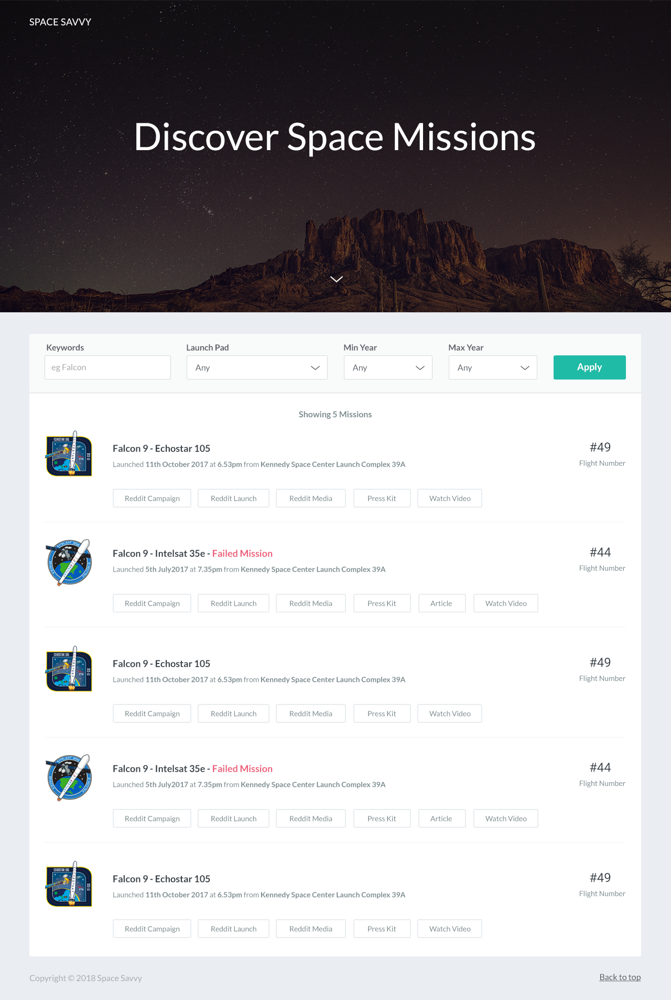

## Overview

This React App is a exercise app from one interview.
It can fetch rocket launchs data from Data Server, filter and display launchs. 
The detail requirements are located at 'exercise-requirement' folder.

The Main Page like this: 

In order to run this app properly, you need to run API server.

You can get more and updated information from [spacexpatchlist](https://spacexpatchlist.space) if you are interested on rocket launchs.

## API Server

Need to start API server that provides data.

To start the server, use a separate terminal window with the following:

1. Change into the `server` directory and run `npm install`
2. Start the server via `npm run start`

The following 2 endpoints will now be available.

| Endpoint                             | Description                       |
| ------------------------------------ | --------------------------------- |
| http://localhost:8001/launches       | returns an array of launch data   |
| http://localhost:8001/launchpads     | returns launchpads                |

## Run this App
- `npm install`
- `npm start`

Runs the app in the development mode.\
Open [http://localhost:3000](http://localhost:3000) to view it in your browser.

